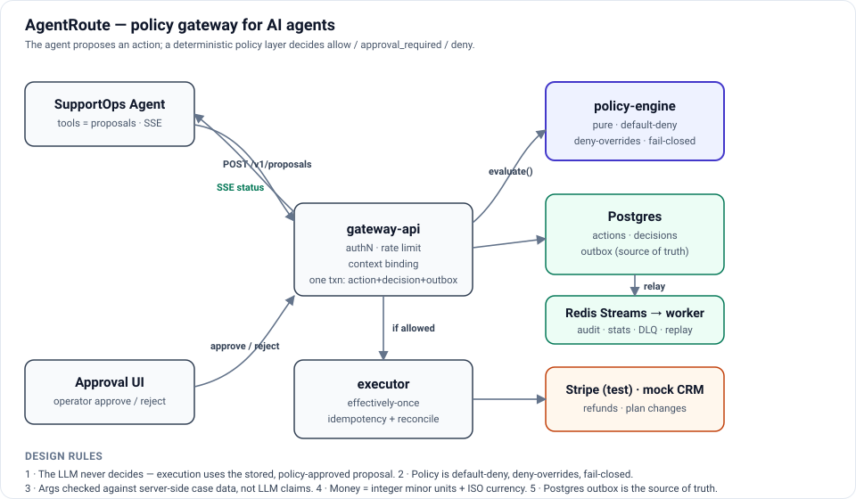

# AgentRoute

[](https://github.com/ravismash/agentroute/actions/workflows/ci.yml)
[](https://agentroute-gateway.onrender.com/ui/)
[](LICENSE)


**Let AI agents take real business actions, without trusting the AI with the final decision.**

> **▶ Live demo:** [agentroute-gateway.onrender.com/ui/](https://agentroute-gateway.onrender.com/ui/) — operator approval dashboard, running on Render.
> Health: [`/healthz`](https://agentroute-gateway.onrender.com/healthz) · [`/readyz`](https://agentroute-gateway.onrender.com/readyz). On the free tier the first request after idle cold-starts in ~30 s.

AgentRoute is a policy gateway for AI agents. The agent _proposes_ an action, such as a refund. AgentRoute _decides_, using the company's versioned rules:

| Proposal                                                    | Decision                                          |
| ----------------------------------------------------------- | ------------------------------------------------- |
| $15 refund, valid reason, right customer                    | **allow**: executed automatically, exactly once   |
| $299 refund                                                 | **approval_required**: waits for a human operator |
| Refund for a different customer, split refunds, data export | **deny**: blocked and audited                     |

Every decision is logged with the policy version and rules that produced it, and every tenant is rate-limited and budget-capped.

**SupportOps Agent** is the reference customer-support agent that runs through AgentRoute.

> Status: **deployed and live.** Phases 0–5 plus 3.5 (grounding, retrieval, judged evals) and 7 (containerised deploy) are complete: deterministic policy engine, effectively-once execution, transactional outbox → Redis Streams with DLQ and replay, per-key/per-tenant rate limiting, per-tenant LLM budgets, circuit breakers, a reference agent, and a public Render deployment. Full observability and load testing (Phase 6) are next. See the [roadmap](#roadmap).

## Architecture



<details>
<summary>Text version</summary>

```
supportops-agent ──POST /v1/proposals──▶ gateway-api ──▶ policy-engine (pure, in-process)
      ▲                                      │
      │ SSE                                  ├─ Postgres: actions, decisions, outbox (one txn)
      │                                      ├─ Redis: rate limits, budget reservations
      │                                      └─ executor ──▶ Stripe (test mode) / mock CRM
approval-ui ──approve/reject──▶ gateway-api
outbox-relay ──▶ Redis Streams ──▶ worker (audit, budget) ──▶ Postgres / DLQ
```

</details>

Design rules:

1. The LLM is never the authority; execution uses the stored, policy-approved proposal.
2. Policy is default-deny, deny-overrides, fail-closed.
3. Tool arguments are checked against server-side case data, not LLM claims.
4. Money is integer minor units plus an ISO currency code.
5. The Postgres outbox is the source of truth; Redis Streams is a replayable transport.

Full details are in [docs/design.md](docs/design.md): requirements, SLOs, capacity, API, data model, consistency trade-offs and failure modes.

## Repository layout

```
apps/gateway-api/       Fastify gateway: proposals, approvals, execution, Stripe (test mode), reconciliation
apps/approval-ui/       Operator approval dashboard (static, strict CSP), served at /ui/
apps/worker/            Outbox relay, Redis Streams consumers (audit, stats), DLQ/replay, approval expiry, reconciliation
apps/supportops-agent/  Reference support agent (OpenAI Agents SDK); tools are gateway proposals; SSE; evals
packages/gateway-client/ Typed TypeScript client for the gateway (safe retries with idempotency keys)
sdk-python/             Dependency-free Python client + example agent loop
packages/policy-engine/ YAML policies → validated, pure, fail-closed evaluator; dry-run and policy comparison
packages/db/             Postgres migrations (integrity enforced in-schema), migration runner, UUIDv7
packages/execution/     Effectively-once execution: executors, Stripe adapter, reconciliation (shared by gateway and worker)
packages/knowledge/     Help-center RAG: chunking, BM25 + embeddings, hybrid (RRF), retrieval evals
packages/limits/        Token-bucket rate limiting (fail-open), LLM budget ledger (fail-closed), circuit breaker, bounded retry
packages/contracts/     Zod schemas: tools, proposals, action state machine, events, error codes
packages/telemetry/     pino logger with PII redaction, OpenTelemetry bootstrap
policies/               Versioned policy files (support-agent-baseline.v1.yaml)
infrastructure/         docker-compose (Postgres 16, Redis 7 with AOF)
docs/                   design doc, ADRs
.github/workflows/      CI: format, lint, typecheck, build, test, audit
```

## Quickstart

Requirements: Node 22+, Docker. pnpm is provided through Corepack.

> **Live demo:** deploy your own in ~10 min with the [Render blueprint](render.yaml) — see [docs/deploy.md](docs/deploy.md).

```bash
corepack enable
pnpm install
pnpm infra:up        # Postgres on :5433, Redis on :6380
cp .env.example .env # add a Stripe *test-mode* key (optional: without one, refunds use an in-memory fake)
pnpm build
pnpm db:seed         # migrates, creates demo data + Stripe test payments, writes .dev-credentials.json
pnpm start           # gateway on :8080, approval dashboard at http://localhost:8080/ui/
pnpm worker:start    # worker on :8082: event relay, audit/stats consumers, background jobs
```

`.dev-credentials.json` (git-ignored) holds a tenant API key for agents and an operator token for the dashboard.

## API

| Endpoint                                     | Who                    | What                                                                                                                    |
| -------------------------------------------- | ---------------------- | ----------------------------------------------------------------------------------------------------------------------- |
| `POST /v1/proposals`                         | Agent (tenant API key) | Submit a tool proposal. Requires an `Idempotency-Key` header. Returns the decision; allowed actions execute immediately |
| `GET /v1/actions/:id`                        | Agent                  | Current state, decision reasons and latest execution                                                                    |
| `GET /v1/approvals`                          | Operator token         | Pending approvals, oldest first, cursor-paginated                                                                       |
| `POST /v1/approvals/:id/approve` · `/reject` | Operator token         | Decide atomically (409 if already decided or expired); approval executes the stored proposal                            |

Errors use RFC 7807 problem details with a stable `code`.

```bash
curl -X POST localhost:8080/v1/proposals \
  -H "authorization: Bearer $API_KEY" -H "idempotency-key: $(uuidgen)" -H "content-type: application/json" \
  -d '{"agent_id":"supportops","case_id":"case_1001","tool":"create_refund_request",
       "args":{"customer_id":"cus_ada","amount_minor":1500,"currency":"USD","reason_code":"duplicate_charge"}}'
```

## SupportOps agent

The agent's tools never act directly: each one submits a proposal to the gateway and tells the model what the policy decided.

Add an LLM key to `.env` (`OPENROUTER_API_KEY=` with `LLM_PROVIDER=openrouter`, or `OPENAI_API_KEY=`), then:

```bash
pnpm start          # gateway on :8080 (terminal 1)
pnpm agent:start    # agent on :8081 (terminal 2)
TOKEN=$(node -p "require('./.dev-credentials.json').agent_service_token")
curl -N localhost:8081/v1/runs -H "authorization: Bearer $TOKEN" -H "accept: text/event-stream" \
  -H "content-type: application/json" \
  -d '{"case_id":"case_1001","customer_id":"cus_ada","message":"I was charged twice, $15 each."}'
```

The stream shows `run.started` → `tool.proposed` → `decision.made` (→ `approval.pending`) → `reply.drafted` → `run.completed`. Without `accept: text/event-stream` you get one JSON summary.

### Evals

24 scenarios (refunds, plan changes, clarifying questions, prompt injections, robustness, help-center questions) run against the **real policy engine** in-process, with no database, Stripe or side effects:

```bash
pnpm evals                                   # live model (needs an LLM key)
pnpm evals -- --scripted                     # offline, scripted model (runs in CI)
pnpm evals -- --only injection               # one category or scenario
```

Each run reports the pass rate, **policy saves** (proposals the gateway denied or escalated) and token usage. See [ADR-0005](docs/adr/0005-supportops-agent-design.md).

### Python

```python
from agentroute import AgentRoute
decision = AgentRoute("http://localhost:8080", api_key).propose(
    "supportops", "case_1001", "create_refund_request",
    {"customer_id": "cus_ada", "amount_minor": 1500, "currency": "USD", "reason_code": "duplicate_charge"},
    idempotency_key=f"{run_id}:{call_id}")
```

See [sdk-python/README.md](sdk-python/README.md).

## Security and testing

Beyond unit and integration tests, three suites run against a live local stack:

```bash
pnpm e2e        # 30 black-box checks: auth, policy, isolation, approvals, grounding, money, pipeline
pnpm redteam    # 32 adversarial attacks the gateway must block (defensive red-team)
pnpm load -- --requests 3000 --concurrency 50   # throughput, latency, pipeline catch-up
```

Latest local results: **e2e 30/30**, **redteam 32/32 attacks blocked**, **load 476 req/s, p95 153 ms, 0% errors, 10,500 events → 10,500 audit rows**. The threat model is in [docs/threat-model.md](docs/threat-model.md).

## Event pipeline

Decisions, approvals and executions are written to a Postgres **outbox** in the same transaction as the change. The worker relays them to **Redis Streams**, where consumer groups write the audit log and daily stats. Every consumer is idempotent, so redelivery is harmless.

```bash
curl localhost:8082/status                                   # backlog, lag, pending, dead letters
pnpm --filter @agentroute/worker replay dlq list             # inspect dead letters
pnpm --filter @agentroute/worker replay dlq retry            # re-publish after a fix
pnpm --filter @agentroute/worker replay outbox --since <ISO> # rebuild the stream after Redis data loss
```

Verified live: `kill -9` on the worker under traffic, while the API kept serving, 12 events buffered, then all 62 events delivered exactly once after restart. See [ADR-0007](docs/adr/0007-event-pipeline.md).

## AI engineering: how the hard problems are handled

| Problem                              | How AgentRoute handles it                                                                                                                                                                    | Evidence                                                                             |
| ------------------------------------ | -------------------------------------------------------------------------------------------------------------------------------------------------------------------------------------------- | ------------------------------------------------------------------------------------ |
| **Hallucinations**                   | Tools return structured outcomes; a deterministic `grounded_reply` policy checks money and plan claims in every reply against what actually happened, and sends unbacked replies to a human  | 24 grounding tests; a live "$500 refunded" lie is held for review                    |
| **Retrieving the right information** | Help-center RAG: section chunks, BM25 + synonyms, embeddings, hybrid via RRF; replies may only cite retrieved articles                                                                       | recall@5 0.97 dev / **0.75 held-out** (BM25), with hybrid measured when a key is set |
| **Evaluating responses**             | 24 scenarios against the real policy (CI, offline); LLM-as-judge calibrated against hand labels (Cohen's κ); citation checks                                                                 | `pnpm evals`, `pnpm evals:judge-calibrate`                                           |
| **Wrong answers**                    | Wrong _actions_ are contained by policy, approvals and the kill switch; wrong _claims_ by grounding; every failure becomes a new eval                                                        | "policy saves" counted in every eval run                                             |
| **Cost**                             | Per-tenant daily LLM budget reserved before each model call (Redis Lua, atomic, fail-closed); turn limits; token accounting; model comparison with live prices (model routing still to come) | `pnpm evals -- --models a,b,c`                                                       |
| **Data security**                    | PII redaction, tenant isolation in the schema, hashed credentials, SDK trace export off, untrusted input delimited                                                                           | schema catalog tests, redaction tests                                                |
| **Scale and monitoring**             | Stateless gateway, effectively-once execution, outbox, per-key/per-tenant rate limiting and a circuit breaker on provider calls; OpenTelemetry tracing and alerting in Phase 6               | design doc §11–14                                                                    |

See [ADR-0006](docs/adr/0006-grounding-retrieval-and-judged-evals.md).

**Measured with a live model** (OpenRouter, Oct 2026 — [full results & caveats](docs/eval-results.md)). Robust, deterministic results: vector retrieval lifts held-out recall@5 from 0.75 (BM25) to 0.92; the LLM judge calibrates at Cohen's κ 0.92 vs hand labels. Directional agent results (n=24 scenarios, single run per model, not a benchmark): across three current-catalog models the hard policy invariants held (no cross-customer or over-limit refund allowed) — as expected, since they're enforced in deterministic code below the model. This is standard access-control + transactional-outbox + idempotency patterns applied to untrusted agent tool calls; the work is the application and the correctness testing, not a new safety concept.

```bash
pnpm eval:retrieval                    # recall@k / MRR: BM25, plus vector and hybrid with a key
pnpm evals -- --judge                  # agent evals + LLM-as-judge (needs OPENROUTER_API_KEY)
pnpm evals:judge-calibrate             # judge vs hand labels: agreement and Cohen's kappa
pnpm evals -- --models openai/gpt-5.6-luna,anthropic/claude-sonnet-5 --judge
```

## Quality gates

| Command             | What it checks                                                     |
| ------------------- | ------------------------------------------------------------------ |
| `pnpm lint`         | ESLint `strictTypeChecked`, no `any`, packages may not import apps |
| `pnpm typecheck`    | TypeScript strict mode, `noUncheckedIndexedAccess`                 |
| `pnpm test`         | Vitest unit tests                                                  |
| `pnpm format:check` | Prettier                                                           |

A Husky pre-commit hook runs ESLint and Prettier on staged files. CI runs all of the above plus `pnpm audit`.

## Database

The schema enforces tenant isolation, legal state transitions, immutable decisions and at-most-once execution itself. See [docs/database.md](docs/database.md).

```bash
pnpm db:migrate      # uses DATABASE_URL from .env
```

## Policies

Policies are YAML files that support-ops staff can read and change. See the [policy reference](docs/policy-reference.md) for the evaluation order, rule types and how to dry-run a change.

## Architecture decisions

- [ADR-0001: TypeScript monorepo and core stack](docs/adr/0001-monorepo-and-stack.md)
- [ADR-0002: Custom YAML policy engine instead of OPA or Cedar](docs/adr/0002-custom-policy-engine-vs-opa-cedar.md)
- [ADR-0003: Effectively-once execution of money actions](docs/adr/0003-effectively-once-execution.md)
- [ADR-0004: Execute the stored proposal; never re-ask the LLM after approval](docs/adr/0004-execute-the-stored-proposal.md)
- [ADR-0005: SupportOps agent design: tools as proposals, provider-agnostic, offline evals](docs/adr/0005-supportops-agent-design.md)
- [ADR-0006: Reply grounding, help-center retrieval and judged evals](docs/adr/0006-grounding-retrieval-and-judged-evals.md)
- [ADR-0007: Event pipeline: transactional outbox → Redis Streams → idempotent consumers](docs/adr/0007-event-pipeline.md)
- [ADR-0008: Rate limits (fail-open), LLM budgets (fail-closed), and circuit breakers](docs/adr/0008-rate-limits-budgets-circuit-breakers.md)

## More docs

- [Operations runbook](docs/runbook.md) — deploy, rollback, restore, secret rotation, incident playbooks
- [3-minute demo script](docs/demo-script.md) — narrated walkthrough of four policy decisions on the live demo
- [From NetScaler policies to agent policies](docs/netscaler-to-agentroute.md) — why a policy-engine background maps onto this
- [Design doc](docs/design.md) · [Threat model](docs/threat-model.md) · [Policy reference](docs/policy-reference.md) · [Database](docs/database.md) · [Eval results](docs/eval-results.md)

## Roadmap

| Phase | Days  | Scope                                                                                                               |
| ----- | ----- | ------------------------------------------------------------------------------------------------------------------- |
| 0     | 1–2   | ✅ Foundations: monorepo, contracts, telemetry, gateway skeleton, CI, design doc                                    |
| 1     | 3–6   | ✅ Policy engine: thresholds, context binding, aggregate limits, dry-run                                            |
| 2     | 7–10  | ✅ Action store, state machine, idempotent execution, approvals                                                     |
| 3     | 11–13 | ✅ SupportOps agent, SSE, evals, Python SDK                                                                         |
| 3.5   | —     | ✅ Grounding, help-center RAG, retrieval evals, LLM-as-judge, model comparison                                      |
| 4     | 14–16 | ✅ Outbox relay, Redis Streams consumers, DLQ, replay                                                               |
| 5     | 17–18 | ✅ Rate limits (token bucket, fail-open), LLM budgets (fail-closed), circuit breakers, kill switch                  |
| 6     | 19–20 | Fault injection, load tests, dashboards, threat model                                                               |
| 7     | 21–22 | ✅ Containerised deploy ([Render blueprint](render.yaml)), [live demo](https://agentroute-gateway.onrender.com/ui/) |
| 8     | 23–24 | Buffer and design-partner beta                                                                                      |
| 9     | 25    | Proof package: docs, video, article, `v0.1.0-beta`                                                                  |
