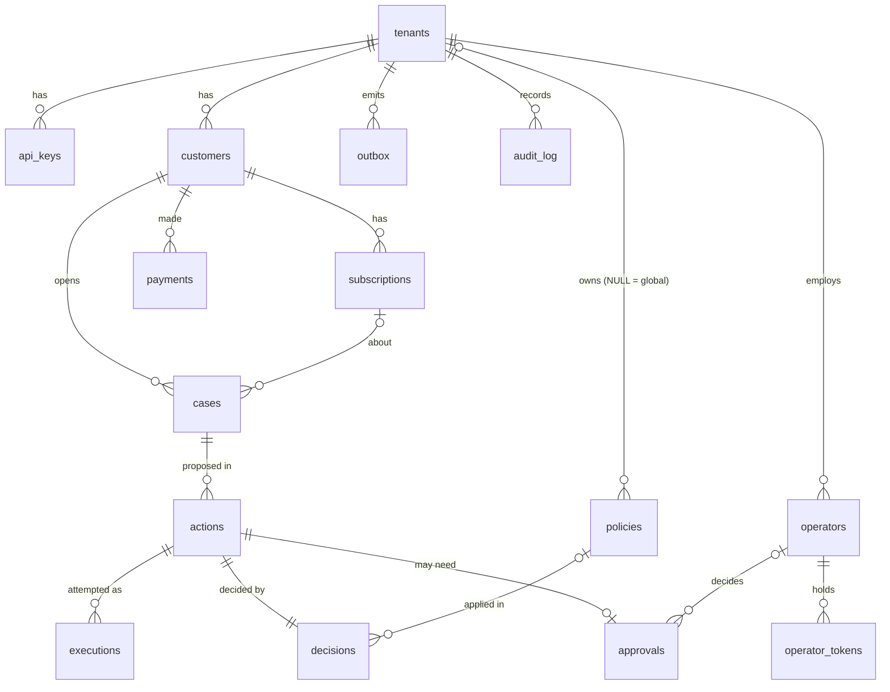

# Database schema

PostgreSQL 16. The schema lives in [`packages/db/migrations`](../packages/db/migrations); apply it with `pnpm db:migrate`.

## Design principles

The database is the last line of defence. Rules that protect money and tenant data are enforced **in the schema**, not only in application code, so a bug in a service cannot break them.

| Rule                                                                                      | How it's enforced                                                                                          |
| ----------------------------------------------------------------------------------------- | ---------------------------------------------------------------------------------------------------------- |
| A row can never reference another tenant's data                                           | Composite foreign keys that include `tenant_id` (e.g. `actions (tenant_id, customer_id, case_id) → cases`) |
| An action's customer must own its case; a case's subscription must belong to its customer | Composite foreign keys on `(tenant_id, customer_id, …)`                                                    |
| Only legal state transitions                                                              | `tr_actions_guard` trigger checks `action_state_transitions`                                               |
| What was decided is what gets executed                                                    | Trigger rejects changes to an action's tool, args, amount, currency, customer or case                      |
| An action succeeds at most once                                                           | Partial unique index `uq_executions_one_success`                                                           |
| No retry while an outcome is unknown                                                      | Partial unique index `uq_executions_one_open` on `started`/`unknown` attempts                              |
| Decisions and audit records can't be altered                                              | Append-only triggers (UPDATE/DELETE, and TRUNCATE on `audit_log`)                                          |
| Policy content is immutable                                                               | Trigger allows only activation changes; edits require a new version                                        |
| One active policy per tenant                                                              | Partial unique index with `NULLS NOT DISTINCT` (NULL tenant = global policy)                               |
| Idempotent requests                                                                       | `UNIQUE (tenant_id, idempotency_key)` plus a stored `request_hash` to detect reused keys                   |
| Money is exact                                                                            | `amount_minor` domain (`bigint`, 1 … 100,000,000) plus `currency_code` domain; both or neither             |

## Conventions

- **Names:** snake_case, plural tables. Constraints use `pk_`, `fk_`, `uq_`, `ck_`; indexes use `ix_` (or `uq_` when unique). Every constraint is named explicitly, so error messages and migrations are readable.
- **Keys:** internal entities use UUIDs generated in the app as **UUIDv7** (time-ordered, which is better for index locality). External ids from CRM/billing are `external_id` text, unique **per tenant** (composite primary keys).
- **Enumerations:** `text` + `CHECK`, not Postgres `ENUM` types, which can't drop values. Drift tests keep them identical to `@agentroute/contracts`.
- **Types:** `timestamptz` only, `jsonb` only (object/array shape checked), `bytea` for hashes with length checks. Shared rules use domains (`external_id`, `currency_code`, `amount_minor`, `sha256_hex`).
- **Indexes:** every foreign key has a supporting index. Partial indexes serve hot paths: the approval queue, unpublished outbox rows, and usage aggregates.
- **Concurrency:** `actions.version` is bumped by trigger. Writers use compare-and-set: `UPDATE … WHERE id = $1 AND state = $2 AND version = $3`, and 0 rows updated means they lost the race.
- **Deletes:** `ON DELETE` is never cascaded on money or audit data. Actions, decisions, policies and audit records cannot be deleted.
- **Functions:** trigger functions pin `search_path`.
- **Documentation:** `COMMENT ON` for tables and non-obvious columns.

These conventions are **tested** in `packages/db/src/schema.test.ts`. The tests query the system catalog and fail if a foreign key lacks an index, a table lacks a primary key or `tenant_id`, a constraint is misnamed, or a naive `timestamp`/`json` column appears.

## Migrations

- Files are named `NNNN_description.sql`, are forward-only, and run in order.
- Each migration runs in one transaction. Start a file with `-- agentroute:no-transaction` for statements that can't run in a transaction (e.g. `CREATE INDEX CONCURRENTLY`).
- A Postgres advisory lock stops two deployments from migrating at the same time.
- Applied migrations are checksummed. **Never edit a released migration**; add a new one.
- The runner refuses to run if the database has migrations this build doesn't know about.
- Schema changes follow **expand → migrate → contract**, so old and new application versions work during a rolling deploy.

## Entity relationships

## Usage aggregates

Aggregate limits (for example, "refund total per case over 30 days") are computed from `actions` with the partial index `ix_actions_usage`. Actions in `denied`, `rejected`, `expired` or `cancelled` states don't count; pending and in-flight actions do, which is the conservative choice. The gateway takes a per-customer advisory lock inside the decision transaction, so two concurrent proposals can't both slip under a limit.

## Planned

- Monthly partitioning of `audit_log` and `outbox` once volume requires it (see design doc §4).
- A least-privilege application role with no DDL and no UPDATE/DELETE on audit tables, created at deployment.
